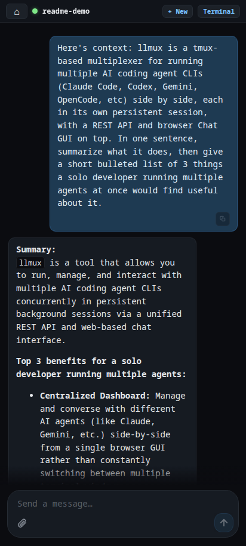
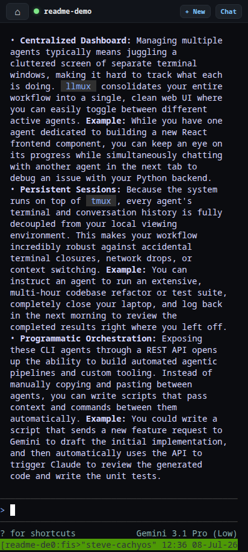
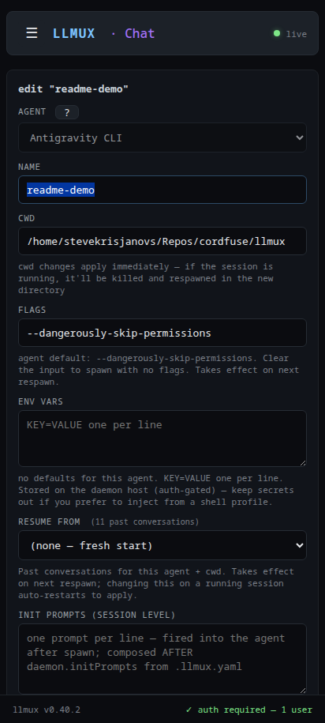
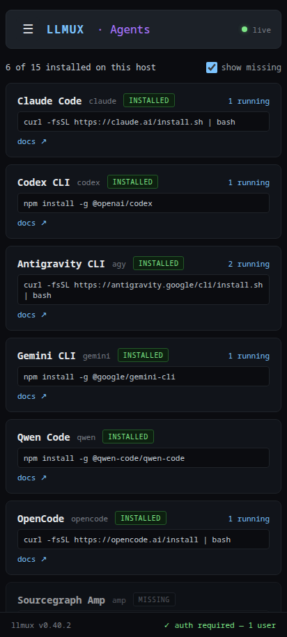
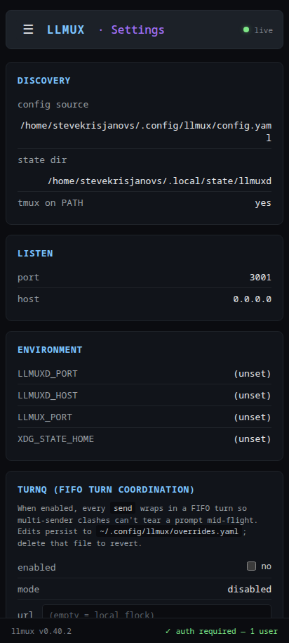
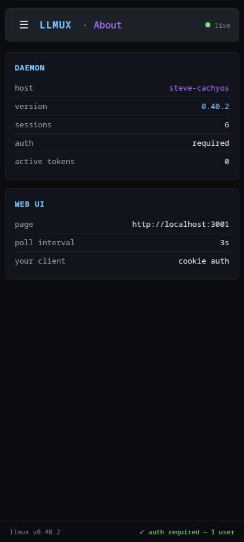

# llmux

[](https://www.npmjs.com/package/@cordfuse/llmux)
[](https://www.npmjs.com/package/@cordfuse/llmux)
[](./LICENSE)
[](./packages/llmux/package.json)

## Problem

You're running Claude Code, Codex, Gemini, OpenCode, and a handful of
other agent CLIs at the same time. Each lives in its own terminal. You
can SSH and `tmux attach`; Claude has cowork and remote-control — but
each agent is on its own terms, and the surface differs per CLI. There's
no unified, addressable layer a spec-driven development pipeline, a
scheduled job, or a multi-agent chain can talk to that treats every
agent CLI the same way.

## Solution

llmux is that layer. One daemon, each agent CLI in its own named tmux
session, every session reachable by name from a CLI, a REST/WebSocket
API, or a browser picker reachable over Tailscale HTTPS.
SDD pipelines, multi-agent chains, scheduled jobs, and evals all reduce
to plain `llmux session prompt <name> "..."` calls — the same surface
drives the human terminal and the script.

Each spawn is its own named tmux session — own cwd, own flags, own
conversation. Run three `claude` sessions across three different repos
side-by-side, or one each of `claude` / `codex` / `gemini`, or fifteen
of each — there's no per-agent cap and no shared state.

First-run OAuth on a headless box works by attaching from a phone (or
any browser), clicking through the flow there, and detaching. Same
trick for token refresh.

(The sessions are real tmux. If you already have an SSH + tmux flow you
like, `tmux attach -t <name>` still works exactly as you'd expect —
llmux just adds the unified surface on top.)

> **Status:** stable. One binary (`llmux`) covers daemon + CLI client.
> Auth + tokens, mobile picker with per-row destructive actions,
> conversation resume across all six Cordfuse-supported agents
> (claude, codex, gemini, agy, opencode, qwen) with a bound-conversation
> indicator on the session row and an in-form "resume from" picker,
> daemon-wide + per-session init prompts, optional turnq FIFO turn
> coordination, an editable Settings page with a runtime overlay file,
> and in-process log tailing have all shipped.
> See [CHANGELOG.md](./CHANGELOG.md) for the per-version detail.

<p align="center">
<table>
<tr>
<td align="center" width="33%">

<br><sub>Chat GUI</sub>
</td>
<td align="center" width="33%">

<br><sub>Terminal / TUI</sub>
</td>
<td align="center" width="33%">

<br><sub>Edit session</sub>
</td>
</tr>
<tr>
<td align="center" width="33%">

<br><sub>Agents dashboard</sub>
</td>
<td align="center" width="33%">

<br><sub>Settings</sub>
</td>
<td align="center" width="33%">

<br><sub>About</sub>
</td>
</tr>
</table>
</p>

<p align="center"><em>Mobile web UI (Pixel 7) — Chat GUI and Terminal views of the same live session, edit form, agent catalog, settings, and daemon info. Every screen also works full-width on desktop.</em></p>

### One persistent process per agent

Each `llmux session start <agent>` launches the agent's interactive TUI
inside a named tmux session and keeps it running. Tool state,
conversation, `/commands`, and MCP context all persist across prompts
and across clients. Spawn once, send keystrokes from a CLI, a REST call,
a WebSocket attach, or the browser picker — the live process is the
source of truth and every client sees the same state.

### Mobile, by design

The web picker is reachable over Tailscale HTTPS from any browser.
Open it from your phone — including over LTE — and you get the same
xterm.js terminal a desktop browser shows, with a soft-keyboard toolbar
that surfaces the chars gboard hides (Esc / Tab / Ctrl / arrows /
shell chars). Bookmark it (or pin the tab) for a one-tap return —
there's no installable home-screen icon, just a regular web page.

A consequence: **first-run OAuth on a headless box just works.** Spawn
an agent on a browserless server, attach from your phone, click through
the browser OAuth flow there, detach. The session stays authed for
re-attaches forever.

> Running the daemon in **WSL2**? Install Tailscale *inside* WSL — see
> [On WSL2](#on-wsl2--install-tailscale-inside-wsl-not-just-on-windows).
> NAT means the `localhost` / LAN URLs won't reach your phone on their own.

### One addressable surface, many use cases

Because each session is reachable by name from any client, llmux is the
substrate higher-level patterns sit on — spec-driven development (SDD)
pipelines, multi-agent chains, scheduled jobs, evals harnessed against
live agents.

## Multiple senders, one session

llmux sessions are shared mutable state. A given named session can receive
prompts from any client — CLI, web, scheduled job — and inputs queue FIFO
at the agent's TUI level. There's no daemon-side concept of "owner" or
"lock."

In practice, **name sessions by purpose**:

- `claude-sdd` for spec-driven dev / headless automation
- `claude-chat` for interactive chat
- `claude-alice` / `claude-bob` for multi-user setups

This is the same pattern as having multiple tmux windows: split by purpose,
let people coordinate via the session name. `llmux session start claude
--name <N>` exists for exactly this — there's no per-agent-type cap.

If you mix headless and interactive on a single named session, expect
transcript conflation: both senders' turns end up in one conversation
history, in send-order. Not a bug, an inherent property of shared state.
Designate one if it matters.

## Init prompts

llmux can fire a sequence of prompts into an agent immediately after the
agent's TUI becomes ready — useful for setting up persistent context
("you work in a TypeScript monorepo, never write Python") that should
apply to every turn in the session.

Two scopes:

- **Daemon-wide** — `initPrompts:` at the top of `.llmux.yaml`. Fired
  into every newly-spawned session before any operator interaction.
- **Per-session** — `--init <prompt>` flag on `session start`
  (repeatable). Composed AFTER the daemon-wide prompts.

```yaml
# .llmux.yaml
initPrompts:
  - |
    You work in a TypeScript monorepo. Never write Python.
  - |
    If the current branch is main, stop and ask before committing.
```

```bash
llmux session start claude --name sdd \
  --init "you process tickets from $REPO" \
  --init "respond in JSON {action, files, reasoning}"
```

**Spawn timing.** The daemon polls the tmux pane for each agent's
`readyPrompt` regex (e.g. `^>` for Claude, `^agy>` for Antigravity CLI). Once
the regex matches the bottom of the pane the prompts fire in order
with a 500ms gap between. Timeout is 10s — if the regex never matches
(agent hung at OAuth, etc.) llmux warns and fires anyway. For agents
without a `readyPrompt` defined, it falls back to a fixed 2-second
sleep.

**Respawn behaviour.** `session restart` re-fires the same init
prompts (re-establishes the operator context). `session resume` does
NOT re-fire (the prompts are already in the conversation history).
Pass `--skip-init` on `session start` or `session restart` to suppress
firing for that single invocation.

**Editing post-spawn.** `session edit <name> --init "..."` replaces
the persisted list. Combine with `--apply` to respawn immediately so
the new prompts take effect.

## turnq — FIFO turn coordination (optional)

By default llmux sessions accept prompts from any client in send-order;
concurrent sends interleave at the tmux level (mostly OK because the
agent CLI buffers input — see the "Multiple senders, one session"
section above). For workflows where strict FIFO matters (multiple
operators, headless SDD pipelines), enable turnq:

```yaml
# .llmux.yaml
turnq:
  enabled: true
  # url: http://localhost:3003   # optional — defaults to local flock(2) mode
  maxHoldMs: 300000               # hard release timeout (default 5 min)
```

How it works:

1. At session spawn, llmux generates a per-session marker
   (`LLMUX_DONE_xxxxxxxx`) and auto-injects a built-in init prompt
   asking the agent to emit `<<LLMUX_DONE_xxxxxxxx>>` on its own line
   as the last line of every response.
2. Each `tmux send-keys` (CLI `session prompt`, web "send" button,
   broadcast) wraps in `turnq.withTurn(channel = "llmux:<session>")`.
3. Inside the turn, llmux polls the pane tail every 400ms for the
   marker. When matched, the turn releases and the next sender goes.
4. If `maxHoldMs` elapses without the marker appearing, llmux force-
   releases with a warning (agent crashed, hung tool call, etc.).
5. The marker line is stripped from the web terminal stream so it
   doesn't clutter the operator's view. CLI `tmux attach` still shows it.

The marker is per-session and uses random bytes, so concurrent
sessions don't false-trigger each other and pre-crafted input can't
spoof a release on someone else's session.

Per-call opt-out: `llmux session prompt <name> "..." --no-turnq` or
`{"skipTurnq": true}` in the HTTP /send body.

If `url` is omitted, the integration uses turnq's local `flock(2)`
mode — no server required. Set `url` to a turnq HTTP server for
cross-process / cross-host coordination.

## Install

### Prerequisites (daemon host)

- **Node.js ≥ 20** — not Bun (`node-pty` attaches to tmux through Node's native prebuilds; Bun caused immediate SIGHUP).
- **tmux** — every agent runs inside a real tmux session, so the daemon host needs `tmux`. Client-only machines don't.
- **A C toolchain on Linux / WSL2** — `node-pty` is a native module. On a fresh Ubuntu / WSL2 (or other minimal Linux) the global install **compiles it from source and fails without build tools** — the most common first-run snag. Install both up front:

```bash
sudo apt install -y tmux build-essential   # Debian / Ubuntu / WSL2
# macOS: `brew install tmux` + Xcode Command Line Tools (xcode-select --install)
```

Then:

```bash
# One package, one binary — installs on the daemon host AND any client machine
npm install -g @cordfuse/llmux
```

If you used the now-deprecated `@cordfuse/llmuxd` package: uninstall it and
install `@cordfuse/llmux` instead. The `llmuxd` binary is gone; the `llmux`
binary covers both daemon and client roles.

## 30-second quickstart

```bash
# 1. Start the daemon (binds REST + WebSocket + browser picker)
llmux server start --port 3001

# 2. Spawn an agent into a named tmux session
llmux session start claude --name main --cwd ~/projects/myapp

# 3. Fire a prompt — fire-and-forget
llmux session prompt main "what does src/index.ts do?"

# 4. Or attach interactively (raw TTY pass-through)
llmux session attach main

# 5. Or open the browser picker (URL is in the server start banner)
#    Pick a session, get a full-screen xterm.js terminal wired over WebSocket.
```

On mobile the picker is a phone-tailored web UI — spawn / restart / kill /
edit / resume past conversations, with a confirmation modal on destructive
actions. The chat page is a phone-friendly xterm with a custom soft-keyboard
toolbar that surfaces Esc / Tab / Ctrl / Alt / arrows / shell chars that
gboard hides.

## Remote operation

The same binary is the client. Set `--server` (or `LLMUX_SERVER` env) on any
session/agent verb and it routes over HTTP instead of operating locally:

```bash
export LLMUX_SERVER=http://192.0.2.10:3001  # or https://<host>.tailnet.ts.net
export LLMUX_TOKEN=sas_…                    # mint with `llmux token create --username <name>`

llmux session list
llmux session prompt main "tomorrow's plan?"
llmux session attach main                   # raw TTY pass-through over WS
llmux session resume main --latest          # rebind to the most recent claude convo
```

Local CLI usage (no `--server` flag) talks to the daemon in-process — no
network request, no token needed. Any HTTP/WS request to the daemon — from
`--server`, a browser, or anything else — requires a real credential: a v2
session/bearer token, or a legacy v1 token. There is no bypass based on
where the request appears to come from. `--token <sas>` per-command works
for remote use.

## Noun-prefix surface

```
session   list / start / stop / restart / edit / attach / prompt /
          broadcast / resume / history
server    start
token     create / list / rename / revoke (single or --all)
agent     list  [--all] [--installed] [--json]
logs      list / tail
settings  show
auth      login / logout / whoami / list / use
```

Global flags: `--server <url>`, `--token <sas>`, `--help`, `--version`.

Backward-compat shims (kept one release): `llmux serve`, `llmux ls`,
`llmux status`, and the legacy flat verbs (`llmux send`, `llmux spawn`,
`llmux kill`, etc.) still work; they fall through to the noun-prefix
dispatcher.

## How it works

Each spawned agent is a real tmux session, not a wrapped PTY. The daemon
dispatches input via `tmux send-keys` and exposes the surface over a REST API
plus a WebSocket bridge to xterm.js (via node-pty attached to
`tmux attach -t <name>`). That keeps the agent CLIs unmodified — Claude Code
is still running Claude Code; llmux just coordinates input and exposes the
surface.

State lives at `~/.local/state/llmuxd/sessions.json` (or
`$XDG_STATE_HOME/llmuxd/sessions.json`) with `0600` perms and a versioned
schema. Auth tokens live in the sibling `auth.json`. The state directory keeps
its `llmuxd/` name across the v0.12.0 package consolidation so existing
operators don't need to migrate anything.

The daemon runs on Node (not Bun) — `node-pty`'s native prebuilds target
Node, and attaching to tmux through node-pty under Bun caused immediate SIGHUP.

## Supported agents

| Key | CLI | Danger-mode default |
|---|---|---|
| `claude`   | [Claude Code](https://docs.claude.com/en/docs/claude-code/overview) | `--dangerously-skip-permissions` |
| `codex`    | [OpenAI Codex CLI](https://github.com/openai/codex) | `--dangerously-bypass-approvals-and-sandbox` |
| `agy`      | [Antigravity CLI](https://antigravity.google) | `--dangerously-skip-permissions` |
| `gemini`   | [Gemini CLI](https://github.com/google-gemini/gemini-cli) | `--yolo` |
| `qwen`     | [Qwen Code](https://github.com/QwenLM/qwen-code) | `--yolo` |
| `opencode` | [OpenCode](https://opencode.ai) | env: `OPENCODE_YOLO=1` (TUI lacks a flag) |

These six are the fully-supported set — spawn, Chat GUI, conversation
history/resume, and the New Chat button all work identically across
every one of them. Only installed agents appear in `llmux agent list`
and the picker dropdown; detection uses a pure-Node PATH walk.

Per-session overrides via `llmux session start <agent>`:
- `--name <X>` — tmux session name (defaults to the agent key)
- `--cwd <path>` — working directory (accepts `~/…` shorthand)
- `--flags "<f>"` — replace the agent's default flags entirely
- `--env "KEY=VAL"` — extra env vars (newline-separated for multiple)

Editing any of these on a running session via the web picker auto-respawns
the tmux session so changes take effect immediately.

## Conversation resume

Every Cordfuse-supported agent ships with a history adapter — the row's
`☰ N` button counts past conversations in the session's cwd and the
picker lists them newest-first. Pick one and llmux respawns the agent
with the right resume flag.

| Agent | Storage | Resume flag |
|---|---|---|
| `claude`   | `~/.claude/projects/<encoded-cwd>/<id>.jsonl` | `--resume <id>` |
| `codex`    | `~/.codex/sessions/YYYY/MM/DD/rollout-<ts>-<uuid>.jsonl` | `resume <id>` (subcommand) |
| `gemini`   | `~/.gemini/tmp/<dir>/chats/session-*.jsonl` (filtered by `projectHash == sha256(cwd)`) | `--session-file <path>` |
| `agy`      | `~/.gemini/antigravity-cli/history.jsonl` (one line per prompt, grouped by `conversationId`) | `--conversation <id>` |
| `opencode` | `~/.local/share/opencode/opencode.db` (sqlite via `better-sqlite3`) | `--session <id>` |
| `qwen`     | `~/.qwen/tmp/<dir>/chats/session-*.jsonl` (Gemini-fork storage) | `--resume <id>` |

The selected conversation id is persisted on the session record so
respawn keeps you on the same conversation. The picked conversation
also gets surfaced two ways:

- **Per-row**: a small purple `↻ <title>` line under the session name,
  visible at a glance from the table.
- **Picker modal**: the bound conversation gets a left-border accent +
  subtle background tint so it's unmistakable in long lists.

You can pick a conversation up front when spawning a session, too —
the new-session form (and the edit form) has a `RESUME FROM` dropdown
populated by `GET /api/conversations?agent=<key>&cwd=<path>`. Changing
the bound conversation from the edit form auto kill+respawns the
session so the new binding takes effect immediately.

From the CLI:

```bash
llmux session resume <name> --latest          # most recent conversation
llmux session resume <name> --conversation <id>
llmux session history <name>                  # list past conversations + ids
llmux session start opencode --resume-from ses_<id>  # spawn pre-bound
```

## Auth

Auth is built around **users**. A fresh `llmux server start` prints a
setup-wizard URL (`/setup?token=…`) you visit once to create the first
admin user with a passphrase. Subsequent logins go through `/login` (web)
or `llmux auth login` (CLI), both of which mint **identity tokens** that
are bound to the authenticated user.

Tokens are owned. The Tokens page in the web UI (drawer → Tokens) shows
every token's owner, and admins can mint a token for any user; non-admins
can only mint their own. From the CLI:

```bash
llmux token create --username alice --name phone-mac
# prints sas_…<43-char-base64url> once; copy it.
# pass --qr-endpoint tailscale-https for a QR-code deep-link that logs you
# in on first scan from a phone.

llmux token list                       # every token (with owner column)
llmux token list --user alice          # filter to one user
llmux token revoke <id>
llmux token revoke --all --user alice  # nuke every token alice owns
```

After the first user exists, every HTTP/WS request to the daemon requires
either `Authorization: Bearer <sas>` (CLI / curl) or the `llmux_session`
cookie set by browser login — regardless of where the request appears to
come from. Local CLI usage (no `--server` flag) needs no token because it
never makes an HTTP request at all — it calls the daemon's handlers
in-process.

> v1 SAS tokens (the `sas_<id>` format without an owning user, from
> pre-v0.37 releases) are read-only. Existing v1 tokens keep validating
> until manually revoked, but no new ones can be minted. Rotate to
> user-owned tokens when convenient.

## Tailscale serve fronting

To reach llmux's web picker from another tailnet device (phone, laptop, …)
over HTTPS, front the daemon with `tailscale serve`. Tailscale terminates
TLS at the tailnet edge; llmux stays plain HTTP behind it.

**Why a custom port, not 443?** Tailscale serve allows exactly one mapping
per `host:port`. If you run more than one Cordfuse app on the same machine
(llmux + vyzr + …), they can't all claim port 443 — adding a second app on
443 silently kicks the first one off. The Cordfuse convention is to give
each app its own custom HTTP/HTTPS port pair so they coexist without
collision. **llmux's convention is `3080` (HTTP) / `3443` (HTTPS).**

```bash
tailscale serve --bg --https=3443 http://localhost:3001
tailscale serve --bg --http=3080  http://localhost:3001
```

The server-start banner picks up the mapping automatically (any port, not
just 3443/3080) and surfaces the resulting URLs:

```
llmux v0.33.1

  ▸ Tailscale HTTPS  https://<host>.tailnet.ts.net:3443
  ▸ Tailscale HTTP   http://<host>.tailnet.ts.net:3080
  ▸ Local            http://localhost:3001
  ▸ LAN              http://192.168.x.x:3001
```

The browser picker is a clean TLS surface — open it in Chrome / Safari
on any tailnet device. CLI `attach` currently speaks `ws://` only —
point it at the LAN or local HTTP URL.

**Cordfuse port conventions** (each app fronted on its own pair so
multiple tools can share one tailnet host):

| App | HTTP port | HTTPS port |
|---|---|---|
| llmux | `3080` | `3443` |
| vyzr  | `3081` | `3444` |

(Pick non-overlapping ports for any additional Cordfuse app you front.)

### On WSL2 — install Tailscale *inside* WSL, not just on Windows

If the daemon runs in **WSL2**, Tailscale is the cleanest — and recommended —
way to reach the web picker from your phone. WSL2 sits behind a NAT'd virtual
network, so the daemon's `localhost` / `LAN` URLs are **not reachable from
other devices**: `localhost` only forwards from the Windows host itself, and
the WSL `172.x` address is internal. Reaching it over the LAN otherwise means
an elevated `netsh interface portproxy` + firewall rule on Windows that breaks
every time WSL's internal IP changes (each `wsl --shutdown` / reboot).

Tailscale sidesteps all of that. Install it **inside the WSL distro** (the
Windows-host Tailscale node does *not* expose WSL's ports) so the WSL instance
joins your tailnet as its own node with a **stable** IP + MagicDNS name:

```bash
curl -fsSL https://tailscale.com/install.sh | sh
sudo tailscale up --hostname=<host>-wsl   # distinct from the Windows host's node
```

Then front the daemon with `tailscale serve` exactly as above and open the
HTTPS URL from any tailnet device. Stable across reboots, no admin/`netsh`/
firewall changes, and it works over LTE — not just your local WiFi.

- Modern WSL2 kernels ship `/dev/net/tun`, so Tailscale runs in normal mode
  (no `--tun=userspace-networking` needed). Verify with `ls /dev/net/tun`.
- Enable systemd in `/etc/wsl.conf` (`[boot]\nsystemd=true`) so `tailscaled`
  runs as a service and survives WSL restarts.
- `--hostname=<host>-wsl` avoids a name collision with the Windows host, which
  reports the same machine name to the tailnet.

## Config (`.llmux.yaml`)

Optional YAML config file. llmux runs without it — defaults are baked into
`agents.ts`. Use the YAML to override per-agent launch behavior or change
the daemon's default port without baking a flag into every shell alias.

### Discovery order (first hit wins)

1. `--config <path>` flag
2. `./.llmux.yaml` — auto-discovered in the cwd you invoke from
3. `~/.config/llmux/config.yaml` — global default
4. `LLMUX_CONFIG=<path>` env var

### Schema

```yaml
# Server defaults — used when `llmux server start` runs with no overriding
# flag / env. Precedence: --port flag > LLMUXD_PORT env > server.port here.
server:
  port: 3001          # daemon listen port (default 3001 when key omitted)

# Per-agent overrides. Key matches the agent's `key` in the catalog
# (claude, codex, agy, gemini, qwen, opencode, amp, grok, aider, continue,
# kiro, cursor, plandex, goose, copilot). Only the keys you list override;
# everything else falls through to the catalog default.
agents:
  claude:
    cmd: claude       # binary path or PATH-lookup name (default: agent's catalog cmd)
    flags: ""         # launch flags appended after cmd (default: catalog default,
                      # e.g. "--dangerously-skip-permissions" for claude).
                      # Empty string disables the default flags entirely.
  codex:
    flags: "--model gpt-5"  # keep `codex` as the binary, override flags
```

### Worked examples

**Strip danger-mode flags from claude on a shared machine:**

```yaml
agents:
  claude:
    flags: ""        # claude launches with no flags — full permission prompts
```

**Point gemini at a wrapper script (logging, rate-limiting, whatever):**

```yaml
agents:
  gemini:
    cmd: /usr/local/bin/gemini-wrapped
```

**Run the daemon on a non-default port project-wide:**

```yaml
server:
  port: 8080
```

A bare `llmux server start` from any cwd containing this file binds to
`:8080`. `--port 3001` still wins per-invocation.

### What this YAML does NOT do today

The schema includes `server.token`, `server.tokenExpiry`, `server.noQr`,
and `sessions[]` (auto-spawn list).
These are reserved for future wiring — setting them has no effect yet.
If you need any of these surfaces, file an issue and they can be
prioritised.

### Runtime overlay (`~/.config/llmux/overrides.yaml`)

The web UI's Settings page is editable for two fields — daemon-wide
`initPrompts` and the `turnq` subconfig. Edits never touch the
base `.llmux.yaml` (its comments + formatting stay pristine);
they write to a separate **runtime overlay** at
`~/.config/llmux/overrides.yaml`.

```yaml
# llmux runtime overrides — written by the Settings page in the web UI.
# Layered on top of the base .llmux.yaml / config.yaml at load time.
# Delete this file to revert all UI edits to the on-disk base config.
initPrompts:
  - seed prompt
turnq:
  enabled: true
  maxHoldMs: 30000
```

Behaviour:

- `loadConfig()` reads the base, then layers the overlay on top.
  Overlay fields win.
- Atomic writes (write-to-tmp + rename) so a partial write can't tear
  the file.
- Delete the overlay file to revert all UI edits in one shot.
- The Settings page shows an `overlay active` badge + an "Active
  overrides" card with the verbatim overlay YAML when the overlay
  exists, so operators can see exactly what was written.

## Settings + logs from the CLI

The web UI's Settings + Logs screens have CLI equivalents for headless
use:

```bash
llmux settings show              # config source, state dir, env, loaded YAML
llmux settings show --json       # same payload, structured

llmux logs list [--limit N]      # last N buffered log lines (default 200)
llmux logs tail                  # initial buffer + live-tail until Ctrl-C
llmux logs tail --since <ISO>    # tail from a specific timestamp
```

The daemon keeps a 500-line in-process ring buffer. Both verbs read
from it locally; there's no remote `--server` mode (logs are
local-only by design).

## Environment

| Variable | Purpose |
|---|---|
| `LLMUX_SERVER` | Default `--server` URL for session/agent verbs |
| `LLMUX_TOKEN`  | Default `--token` SAS auth |
| `LLMUXD_PORT`  | Daemon listen port (consulted by `server start` + QR builders) |
| `LLMUXD_HOST`  | Daemon bind host (defaults to `0.0.0.0`) |
| `LLMUX_PORT`   | Legacy port hint for QR builders; prefer `LLMUXD_PORT` |
| `XDG_CONFIG_HOME` | Override for the config directory parent (used by the dotenv loader) |
| `XDG_STATE_HOME` | Override for the state directory parent |
| `OPENCODE_YOLO`, `GOOSE_MODE`, … | Forwarded by `envDefaults` per-agent |

### Auto-loaded `.env`

On every invocation, `llmux` reads `$XDG_CONFIG_HOME/llmux/.env` (falling back to
`~/.config/llmux/.env`). Any variable from the table above can live there:

```
LLMUX_SERVER=https://llmux.example.com
LLMUX_TOKEN=sas_…
LLMUXD_PORT=3001
```

- **Process env wins.** A shell `export LLMUX_TOKEN=…` always overrides the file.
- **Missing file is silent** — no warning, no error.
- The file is read **before** flag parsing, so any code that consults `process.env.LLMUX_*`
  sees the merged result. Applies to both client and daemon commands.

## License

MIT. See [LICENSE](./LICENSE).

---

llmux is part of the [Cordfuse](https://github.com/cordfuse) AI agent toolchain.
